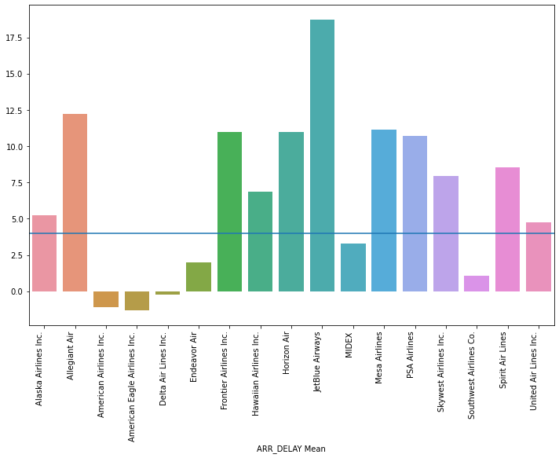

# Flight Delay Prediction

Exploratory data analysis and machine-learning experiments for predicting airline flight delays from operational flight data.

## Workflow

The notebook performs data cleaning, exploratory analysis, feature inspection, model fitting, classifier evaluation, and a final conclusion section. Supporting airline and airport reference datasets are included.

## Results and visual analysis

The notebook contains a large set of persisted EDA plots covering delay distributions, airline-level behavior, and origin/destination patterns.

## Data

Included:

- `airlines.csv`
- `airports.csv`

The main flight table, `T_ONTIME_REPORTING.csv`, is referenced by the notebook but is **not included** in this ZIP. The first cell also expects `/content/flight-delays.rar` in Colab.

## Run

Upload the missing flight dataset/archive to Colab, then run the notebook from the top. The code uses pandas, NumPy, Matplotlib/Seaborn, Plotly, SciPy, and scikit-learn.

> Audit change: the original Persian comment in the notebook was translated to English.
